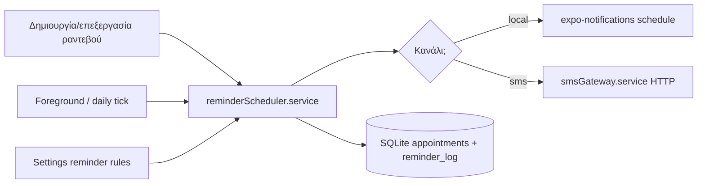

# Backlog ραντεβού

> Τελευταία ενημέρωση: **21 Μαΐου 2026**  
> **§1–§2 υλοποιήθηκαν** (πλέγμα polish, υπενθυμίσεις v18) · myDATA εκτός scope.

---

## Τρέχουσα κατάσταση

| Θέμα | Υπάρχει σήμερα |
|------|----------------|
| Πλέγμα εβδομάδας | `AppointmentWeekGrid.tsx` — στήλη ώρας 48px, ημέρα 96px, ύψος σειράς 52px |
| Πλέγμα μήνα | `AppointmentMonthGrid.tsx` — `minHeight: 88`, κείμενο ραντεβού **8px** |
| Έτος | `AppointmentYearGrid.tsx` — πίνακας 12 μηνών |
| Ετικέτες ασθενή στο grid | `patientLabel()` → `"Μ. Παπαδόπουλος"` (μόνο αρχικό) |
| Ώρα στο grid | `formatTimeShort()` με locale **`en-US`** (όχι `UI_LOCALE`) |
| Κατάσταση ραντεβού | Μόνο **χρώμα** αριστερού border (`statusColor`) — όχι κείμενο |
| Διάρκεια > 30 λεπτά | Block μεγαλώνει ελαφρά στο week grid· **δεν** καλύπτει πολλαπλά slots |
| Υπενθυμίσεις DB | `appointments.reminder_sent`, `reminder_sent_at` (migration v1) |
| Υπενθυμίσεις UI/logic | **Δεν** υλοποιημένες για ραντεβού |
| Push τοπικά | `expo-notifications` — μόνο **backup reminder** (`backupReminder.service.ts`) |
| SMS config | `env.config.ts` + `env.dentalapp.example` — flags, **χωρίς** service αποστολής |

---

## 1. Πλέγμα ραντεβού — polish (μεγαλύτερα κελιά, καθαρότερες ετικέτες)

### Πρόβλημα (σήμερα)

- Σε tablet/μεγάλη οθόνη τα κελιά week view είναι **στενά** (96px) — δύσκολη ανάγνωση ονομάτων.
- Γραμματοσειρές **9–11px** στα blocks· month view **8px**.
- Δεν φαίνεται **τύπος** ή **κατάσταση** ραντεβού (μόνο χρώμα).
- `+N more` στο month grid είναι **αγγλικά**.
- Week grid: ραντεβού 60+ λεπτά δεν «γεμίζουν» οπτικά όλα τα 30λεπτά slots.

### Στόχος προϊόντος

1. **Αναγνωσιμότητα** σε iPhone και iPad (responsive μεγέθη).
2. **Πλήρες όνομα** ασθενή (ή ρυθμιζόμενο: πλήρες / συντομογραφία).
3. **Ελληνικές** ετικέτες ώρας, ημέρας, κατάστασης, τύπου όπου χωράει.
4. **Οπτική διάρκεια** στο week grid (block σε ύψος = slots × ROW_H).

### Προτεινόμενες αλλαγές

#### Φάση A — Κοινά utilities (`appointmentGrid.utils.ts`)

| Αλλαγή | Λεπτομέρεια |
|--------|-------------|
| `formatTimeShort` | `UI_LOCALE` (`el-GR`) αντί `en-US` |
| `patientLabel` | Νέο `patientDisplayName(mode, patients, id)` — `'full' \| 'short'` |
| `statusShortLabel` | Wrapper → `appointmentStatusLabel()` από `el.ts` |
| `typeShortLabel` | Wrapper → `appointmentTypeLabel()` (προαιρετικό 2η γραμμή) |
| `getGridDimensions(width)` | Επιστρέφει `{ timeColW, dayColW, rowH, fontSize }` από breakpoints |

**Breakpoints (προτεινόμενο):**

| Πλάτος | `DAY_COL_W` | `ROW_H` | `aptName` font |
|--------|-------------|---------|----------------|
| &lt; 400 | 88 | 48 | 10 |
| 400–719 | 104 | 56 | 11 |
| ≥ 720 | 120–128 | 64 | 12–13 |

Πέρασμα `useWindowDimensions().width` από `AppointmentsScreen` → props `layoutWidth` στα grids.

#### Φάση B — Week grid (`AppointmentWeekGrid.tsx`)

- Αντικατάσταση σταθερών `TIME_COL_W`, `DAY_COL_W`, `ROW_H` με `getGridDimensions`.
- Block ύψος: `slotSpan = Math.ceil(apt.duration / GRID_SLOT_MINUTES)` → `minHeight: slotSpan * ROW_H - 4`.
- Αν `slotSpan > 1`, render block **μόνο στο πρώτο slot** (filter `appointmentsInSlot` + flag `startsInThisSlot`) — αποφυγή διπλού block.
- Περιεχόμενο block (2–3 γραμμές):
  - `09:30` (ώρα)
  - `Μαρία Παπαδοπούλου` (πλήρες όνομα)
  - `Επιβεβαιωμένο` ή σύντομος τύπος (`Θεραπεία`)
- Legend: ενημέρωση `el.appointments.weekPlanLegend` + μικρή **χρωματική λεζάντα** καταστάσεων (optional chip row).

#### Φάση C — Month grid (`AppointmentMonthGrid.tsx`)

- `minHeight` ημέρας: 96 → **112–120** σε tablet.
- `aptLineText`: 8px → **10–11px**· `+N more` → `el.appointments.moreAppointments` (`+{n} ακόμα`).
- Προαιρετικά **χρωματική κουκκίδα** + ώρα + επώνυμο (χωρίς πλήρες όνομα αν δεν χωράει).

#### Φάση D — Year grid (μικρότερη προτεραιότητα)

- Ελληνικά labels μηνών (ήδη `UI_LOCALE` στο `formatAppointmentViewPeriod` — έλεγχος consistency).
- Μεγαλύτερο tap target σε γραμμή μήνα.

#### Φάση E — Ρυθμίσεις εμφάνισης (optional)

- Στο `SettingsScreen` ή toggle στο `AppointmentsScreen`:
  - «Συντομογραφία ονομάτων στο πλάνο» (default: πλήρες σε week, short σε month).

### Αρχεία

| Αρχείο | Αλλαγή |
|--------|--------|
| `src/components/appointments/appointmentGrid.utils.ts` | dimensions, labels, locale |
| `src/components/appointments/AppointmentWeekGrid.tsx` | responsive + multi-slot blocks |
| `src/components/appointments/AppointmentMonthGrid.tsx` | μεγαλύτερα κελιά, i18n |
| `src/screens/appointments/AppointmentsScreen.tsx` | πέρασμα `width` |
| `src/i18n/el.ts` | `moreAppointments`, legend strings |

### Έλεγχοι (manual)

- [ ] Week: ραντεβού 90 λεπτά καλύπτει 3 slots οπτικά.
- [ ] Week: 2 ραντεβού ίδια ώρα διαφορετικών ημερών — readable.
- [ ] Month: `+2 ακόμα` στα ελληνικά.
- [ ] iPad landscape: χωρίς οριζόντια scroll εκτός αν 7 μέρες × στενό phone.

### Προτεραιότητα

**Μεσαία** — καθαρή UX, χωρίς backend · εκτιμώμενο **1–2 sessions**.

---

## 2. Υπενθυμίσεις ραντεβού — Push / SMS

### Πρόβλημα (σήμερα)

- Πεδία `reminder_sent` / `reminder_sent_at` **δεν ενημερώνονται** από καμία ροή.
- Δεν υπάρχει προγραμματισμός, πρότυπα μηνυμάτων, ούτε ρύθμιση ανά ασθενή.
- **Push (remote)** απαιτεί server + FCM/APNs — **εκτός** pure offline app.
- **SMS** απαιτεί εξωτερικό gateway (Web API) — config υπάρχει, όχι client.

### Στόχος προϊόντος (MVP → πλήρες)

| Κανάλι | MVP (ρεαλιστικό στο app) | Φάση 2 |
|--------|---------------------------|--------|
| **Τοπικό Push** | `expo-notifications` — προγραμματισμένη ειδοποίηση X ώρες πριν (στη συσκευή που έκλεισε το ραντεβού) | — |
| **SMS** | Αποστολή μέσω HTTP API (όταν `FEATURE_SMS_REMINDERS=true`) | Delivery status, templates editor |
| **Email** | Εκτός MVP (ίδια αρχιτεκτονική με SMS) | SMTP / SendGrid |
| **Remote Push** | Εκτός MVP | Backend + device tokens |

### Αρχιτεκτονική (προτεινόμενη)



#### Δεδομένα (migration v18 — προτεινόμενο)

**Πίνακας `appointment_reminder_log`:**

```sql
CREATE TABLE appointment_reminder_log (
  id TEXT PRIMARY KEY,
  appointment_id TEXT NOT NULL,
  channel TEXT NOT NULL,  -- 'local_push' | 'sms'
  scheduled_for TEXT NOT NULL,
  sent_at TEXT,
  status TEXT NOT NULL,   -- 'scheduled' | 'sent' | 'failed' | 'cancelled'
  error_message TEXT,
  notification_id TEXT,   -- expo id για local push
  created_at TEXT NOT NULL,
  FOREIGN KEY (appointment_id) REFERENCES appointments(id) ON DELETE CASCADE
);
```

**Πίνακας `reminder_settings` (μία γραμμή default + προαιρετικά ανά patient):**

```sql
CREATE TABLE reminder_settings (
  id TEXT PRIMARY KEY,
  scope TEXT NOT NULL,           -- 'practice' | 'patient'
  patient_id TEXT,
  enabled INTEGER DEFAULT 1,
  hours_before INTEGER DEFAULT 24,
  channels TEXT NOT NULL,        -- JSON ["local_push","sms"]
  sms_template TEXT,
  push_template TEXT,
  updated_at TEXT NOT NULL
);
```

**`patients` (προαιρετικό v18):**

- `reminder_opt_out INTEGER DEFAULT 0`
- `preferred_phone TEXT` (ή χρήση `phone`)

#### Services

| Service | Ευθύνη |
|---------|--------|
| `reminderScheduler.service.ts` | `scheduleRemindersForAppointment(apt)` / `reschedule` / `cancel` |
| `smsGateway.service.ts` | `sendSms({ to, body })` — fetch προς `config.smsGateway` |
| `reminderTick.service.ts` | Στο app launch + `AppState` active: επεξεργασία overdue, retry failed |

**Πρότυπο SMS (ελληνικά, παράδειγμα):**

```
{clinicName}: Υπενθύμιση ραντεβού {date} {time}. {patientName}. Ακύρωση: {phone}
```

**Πρότυπο local push:**

```
Ραντεβού αύριο 10:30 — Μαρία Παπαδοπούλου
```

#### UI

| Οθόνη | Στοιχεία |
|-------|----------|
| **Settings** → «Υπενθυμίσεις ραντεβού» | Ενεργό, ώρες πριν (24/48), κανάλια (toggle Push / SMS), test SMS |
| **AddEditAppointment** | Preview «Θα σταλεί υπενθύμιση 24 ώρες πριν»· αν `reminder_sent` → «Στάλθηκε στις …» |
| **AppointmentDetail** | Κουμπί «Στείλε τώρα SMS» (manual)· ιστορικό από `appointment_reminder_log` |
| **Patient** (optional) | Opt-out υπενθυμίσεων |

#### Push — τεχνικές σημειώσεις

- **Local notifications** (ίδιο pattern με `backupReminder.service.ts`):
  - Trigger: `date` = `startTime - hoursBefore`.
  - Αν η ώρα είναι στο παρελθόν → skip ή «στείλε τώρα» μόνο manual.
  - Στο update ραντεβού: `cancelScheduledNotificationAsync(oldId)` + νέο schedule.
  - Android channel: `appointment-reminders`.
- **Περιορισμός iOS/Android:** αν ο χρήστης κλείσει την app μετά το schedule, τα local triggers **συνήθως** λειτουργούν· όχι guaranteed μετά reboot — document στο UI.
- **Remote push:** χρειάζεται backend cron + Expo Push Token — backlog φάσης 2.

#### SMS — τεχνικές σημειώσεις

- Κλήση **μόνο** όταν `config.smsGateway.enabled && apiKey`.
- Αριθμός: normalization ελληνικού κινητού (`69…` → `+3069…`).
- **Δεν** αποθηκεύουμε API key στο SQLite — μόνο env / secure store.
- Μετά επιτυχούσα αποστολή: `UPDATE appointments SET reminder_sent=1, reminder_sent_at=?`.
- Σφάλμα gateway: `reminder_log.status='failed'`, εμφάνιση στο detail.

#### Background / χωρίς server

Επιλογές για MVP χωρίς cloud:

1. **On save appointment** — schedule όλα τα local notifications αμέσως.
2. **On app open** (`App.tsx` / `useFocusEffect` global) — `processDueSmsReminders()` για SMS που έπρεπε να σταλούν ενώ η app ήταν κλειστή (αν `scheduled_for <= now` και `status=scheduled`).

> Για αξιόπιστο SMS 24h πριν χωρίς ανοιχτό app, **τελικά** χρειάζεται server cron ή third-party scheduler — να το σημειώνουμε στο UI ως «απαιτεί ενεργό app ή cloud» στο MVP.

### Αρχεία (νέα / τροποποίηση)

| Αρχείο | Αλλαγή |
|--------|--------|
| `src/services/database/migrations.ts` | v18 tables |
| `src/services/appointment/reminderScheduler.service.ts` | νέο |
| `src/services/appointment/smsGateway.service.ts` | νέο |
| `src/services/appointment/appointment.service.ts` | κλήση scheduler on create/update/delete |
| `src/screens/settings/SettingsScreen.tsx` | ενότητα υπενθυμίσεων |
| `src/screens/appointments/AddEditAppointmentScreen.tsx` | preview / manual send |
| `src/screens/appointments/AppointmentDetailScreen.tsx` | log + resend |
| `src/i18n/el.ts` | strings |
| `App.tsx` | `processDueReminders()` on mount |
| `config/env.config.ts` | ήδη έτοιμο |

### Έλεγχοι (manual)

- [ ] Νέο ραντεβού αύριο → local notification στο notification center (με permission).
- [ ] Μετακίνηση ώρας → παλιό notification ακυρώνεται.
- [ ] Διαγραφή ραντεβού → ακύρωση notification + log `cancelled`.
- [ ] SMS test από Settings (με valid API key).
- [ ] Ασθενής χωρίς τηλέφωνο → SMS skip, μόνο push αν enabled.

### Προτεραιότητα & φάσεις

| Φάση | Περιεχόμενο | Προτεραιότητα |
|------|-------------|---------------|
| **2a** | Local push + settings + scheduler on save | **Μεσαία** |
| **2b** | SMS gateway + log + manual / tick send | **Μεσαία** (εξαρτάται από provider) |
| **2c** | Patient opt-out, templates UI, email | Χαμηλή |
| **2d** | Cloud cron / remote push | Μελλοντική |

**Σύσταση σειράς:** πρώτα **§1 πλέγμα** (γρήγορο UX win), μετά **§2a push**, μετά **§2b SMS** όταν υπάρχει API key παραγωγής.

---

## 3. Σύνοψη backlog (ραντεβού)

| Προτεραιότητα | Θέμα | Έγγραφο |
|---------------|------|---------|
| ✅ | Πλέγμα — responsive, EL labels, multi-slot week | §1 — υλοποιήθηκε |
| ✅ | Υπενθυμίσεις — local Push (v18 + scheduler) | §2a — υλοποιήθηκε |
| ✅ | Υπενθυμίσεις — SMS gateway + manual send | §2b — υλοποιήθηκε |
| Χαμηλή | Email, remote push, patient templates | §2c–2d |

**Σχετικό κλινικό backlog:** [BACKLOG_CLINICAL.md](./BACKLOG_CLINICAL.md)  
**myDATA:** τέλος λίστας (αναβολή).

---

*Έγγραφο προδιαγραφών — όχι αλλαγές κώδικα.*
