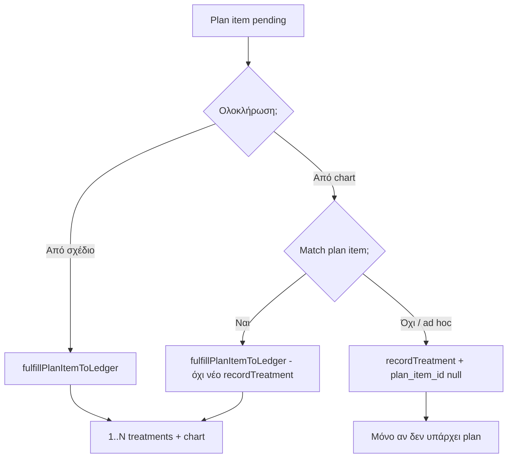

# Backlog κλινική — προς υλοποίηση

> Τελευταία ενημέρωση: **21 Μαΐου 2026**  
> Σχετικά commits: `401896f` (εναλλακτικές σχεδίων, PDF, clinic `scheduled`) · myDATA εκτός scope.

---

## 1. Bug: πολλά δόντια σε θεραπεία σχεδίου → λογιστήριο

### Σύμπτωμα (σήμερα)

Στο `PatientTreatmentPlanDetailScreen` μπορείς να καταχωρήσεις **πολλά FDI** σε ένα plan item (`tooth_numbers` JSON, π.χ. `11, 12, 21`).

Όταν ολοκληρώνεις με **«Ολοκλήρωση + χρέωση»** (ή μαζική καταχώρηση σχεδίου), καλείται `fulfillPlanItemToLedger`:

```620:621:src/services/clinical/treatmentPlan.service.ts
  const toothNumber =
    ctx.toothNumbers.length === 1 ? ctx.toothNumbers[0]! : ctx.toothNumbers[0] ?? null;
```

- Δημιουργείται **μία** γραμμή στο `treatments` (μόνο το **πρώτο** δόντι).
- Το `dental_chart` ενημερώνεται **μόνο** για αυτό το δόντι.
- Στα `notes` γράφονται όλα τα δόντια, αλλά το **κόστος** μένει ενιαίο σε μία χρέωση.
- Το `treatment_plan_items.treatment_id` είναι **ένα** FK — δεν μπορεί να δέσει πολλές χρεώσεις.

**Αποτέλεσμα:** λάθος λογιστήριο, λάθος οδοντόγραμμα, δύσκολη διαγραφή/αναίρεση όταν διαγράφεται το item.

### Αναμενόμενη συμπεριφορά (προϊόν)

| Περίπτωση | Συμπεριφορά |
|-----------|-------------|
| 1 δόντι | Όπως τώρα — 1 `treatments` + chart για το δόντι |
| N δόντια (ίδια διαδικασία) | **N χρεώσεις** (ή 1 χρέωση με ρητή επιλογή χρήστη — προτείνεται N) |
| 0 δόντια (γενική διαδικασία) | 1 `treatments` με `tooth_number = NULL` (όπως chart) |

**Κατανομή κόστους (προτεινόμενο MVP):** ισόποσα `estimated_cost / N` ανά δόντι· αν `cost` null → null σε όλες.

**Οδοντόγραμμα:** κάθε `recordTreatment` με δικό του `toothNumber` → ξεχωριστό upsert `dental_chart`.

### Τεχνική πρόταση υλοποίησης

#### Βήμα A — Service (`treatmentPlan.service.ts`)

1. Αντικατάσταση μονής κλήσης `recordTreatment` σε **βρόχο** `for (const tooth of teethToBill)`.
2. Γενικές διαδικασίες (`GENERAL_PROCEDURE_SET`): ένα `recordTreatment` χωρίς δόντι (όχι βρόχος).
3. **Σύνδεση plan ↔ ledger:**
   - **Επιλογή 1 (ελάχιστο schema):** κρατάμε `treatment_id` = id **πρώτης** χρέωσης· οι υπόλοιπες στο `notes` + prefix `plan_item_id:<uuid>` για αναζήτηση στη διαγραφή.
   - **Επιλογή 2 (καθαρότερο):** migration **v17** — στήλη `treatment_ids TEXT` (JSON array) στο `treatment_plan_items`· αντικατάσταση/παράλληλα με `treatment_id` για συμβατότητα UI «στο λογιστήριο».

4. **`deleteTreatmentPlanItem` / `deleteTreatmentPlanPhase` / `deleteTreatmentPlanAlternative`:** διαγραφή **όλων** συνδεδεμένων `treatments` (όχι μόνο `treatment_id`).

#### Βήμα B — UI

- Στο plan item: εμφάνιση «Θα καταχωρηθούν **N** χρεώσεις» στο alert «Ολοκλήρωση + χρέωση» όταν `toothNumbers.length > 1`.
- Στο ledger / ιστορικό: εμφάνιση ότι προήλθε από το ίδιο plan item (ίδιο `notes` / `plan_item_id`).

#### Βήμα C — Έλεγχοι

- Unit-style tests (ή manual checklist): item με 3 δόντια → 3 rows στο `treatments`, 3 chart updates, σωστό άθροισμα κόστους.
- Idempotency: δεύτερη κλήση `fulfillPlanItemToLedger` δεν διπλασιάζει (ήδη `treatment_id` / `treatment_ids` set).

### Αρχεία

| Αρχείο | Αλλαγή |
|--------|--------|
| `src/services/clinical/treatmentPlan.service.ts` | `fulfillPlanItemToLedger`, delete helpers |
| `src/services/database/migrations.ts` | v17 optional `treatment_ids` |
| `src/screens/clinical/PatientTreatmentPlanDetailScreen.tsx` | copy στο alert |
| `src/i18n/el.ts` | strings N χρεώσεων |

### Προτεραιότητα

**Μεσαία** — επηρεάζει χρήματα και chart· μικρό diff αν μείνει μόνο βρόχος + διορθωμένη διαγραφή.

---

## 2. Odontogram ↔ σχέδιο θεραπείας (χωρίς διπλή χρέωση)

### Πρόβλημα (σήμερα)

Δύο **ανεξάρτητες** ροές για την ίδια κλινική πράξη:

| Ροή | Τι γράφει |
|-----|----------|
| **Σχέδιο** → ολοκλήρωση + χρέωση | `treatments` + `dental_chart` μέσω `fulfillPlanItemToLedger` |
| **Οδοντόγραμμα** (`PatientChartScreen`) → `recordTreatment` | Νέο `treatments` + chart **χωρίς** έλεγχο αν υπάρχει plan item |

Αποτέλεσμα: **διπλή χρέωση** στο λογιστήριο και σύγχυση «τι ισχύει» στο chart.

Δεν υπάρχει:

- οπτική ένδειξη στο odontogram για **προγραμματισμένες** θεραπείες σχεδίου·
- `plan_item_id` / `treatment_plan_id` στο `treatments`·
- σύνδεση plan item ↔ καταχώρηση από chart.

### Στόχος προϊόντος

1. **Μία** χρέωση ανά ολοκληρωμένη πράξη (είτε από σχέδιο είτε από chart).
2. Ο οδοντογράφος δείχνει **τι είναι στο ενεργό σχέδιο** (επιλεγμένη εναλλακτική, `pending` / `scheduled`).
3. Από chart: αν υπάρχει ανοιχτό plan item για **ίδιο δόντι + διαδικασία** → προτείνεται **ολοκλήρωση από σχέδιο** αντί για νέα χρέωση.
4. Από σχέδιο: σύνδεση «δες δόντι στο chart» (navigation + highlight).

### Προτεινόμενες φάσεις

#### Φάση 1 — Δεδομένα (migration v17)

```sql
ALTER TABLE treatments ADD COLUMN plan_item_id TEXT REFERENCES treatment_plan_items(id);
-- προαιρετικά: treatment_plan_id TEXT για αναφορά στο container
```

- `fulfillPlanItemToLedger`: περνά `planItemId` στο `recordTreatment` (ή εσωτερικό helper).
- `recordTreatment` / `RecordTreatmentInput`: optional `planItemId`.
- Index: `idx_treatments_plan_item ON treatments(plan_item_id)`.

#### Φάση 2 — Ανάγνωση pending plan items για chart

Νέο helper π.χ. `getOpenPlanItemsForPatient(patientId)`:

- Σχέδια `status IN ('presented','approved','in_progress')`.
- Μόνο **επιλεγμένη** εναλλακτική ανά σχέδιο (ή όλες — απόφαση UX).
- Items `status IN ('pending','scheduled')` με `treatment_id IS NULL`.
- Επιστροφή: `{ planId, planTitle, itemId, procedureType, toothNumbers[] }[]`.

#### Φάση 3 — UI οδοντογράμματος (`PatientChartScreen`, `ArcOdontogram`)

- **Overlay / badge** σε δόντια με open plan items (π.χ. μικρή κουκκίδα ή περιγραμματικό πλαίσιο — χωρίς αλλαγή condition colors).
- Modal δοντιού:
  - Λίστα «Από σχέδιο: …» με κουμπί **«Ολοκλήρωση από σχέδιο»** → `fulfillPlanItemToLedger(itemId)` + `updateTreatmentPlanItemStatus(completed)` **χωρίς** δεύτερο `recordTreatment`.
  - Κουμπί **«Καταχώρηση χωρίς σχέδιο»** (ad hoc) — τρέχουσα ροή, με προειδοποίηση αν match plan item.

#### Φάση 4 — Guards (dedup)

Πριν το ad hoc `recordTreatment`:

```
match = open items where tooth in toothNumbers AND procedureType compatible
if (match.length) Alert: «Υπάρχει στο σχέδιο X — ολοκλήρωση από σχέδιο;»
```

- «Συμβατότητα» procedure: ίδιο string ή mapping `conditionFromTreatmentType` ↔ plan `procedure_type`.
- Γενικές διαδικασίες: match μόνο αν plan item **χωρίς** δόντια.

#### Φάση 5 — Σχέδιο → chart (navigation)

- Στο `PatientTreatmentPlanDetailScreen`, αν `toothNumbers.length >= 1`: link **«Δες στον οδοντογράφο»** → `PatientChart` με param `highlightTeeth: number[]`.
- `PatientChartScreen`: scroll/zoom ή flash highlight στα δόντια.

### Ροή χρήστη (target)



### Αρχεία

| Αρχείο | Αλλαγή |
|--------|--------|
| `src/services/database/migrations.ts` | v17 `plan_item_id` |
| `src/services/clinical/treatment.service.ts` | `RecordTreatmentInput`, insert |
| `src/services/clinical/treatmentPlan.service.ts` | helpers, fulfill, queries |
| `src/screens/clinical/PatientChartScreen.tsx` | pending list, modal, guards |
| `src/components/clinical/odontogramShared.tsx` / `ArcOdontogram.tsx` | optional `plannedTeeth` prop |
| `src/screens/clinical/PatientTreatmentPlanDetailScreen.tsx` | link to chart |
| `src/navigation/navigation.types.ts` | `PatientChart` params |
| `src/i18n/el.ts` | strings overlay / alerts |

### Εξαρτήσεις

- **Συνιστάται πρώτα** το fix **§1 πολλά δόντια**, ώστε το `fulfillPlanItemToLedger` να είναι σωστό πριν το γίνει κεντρικό path από chart.

### Προτεραιότητα

**Μεσαία–υψηλή** (κλινική ακρίβεια + οικονομικά) — μεγαλύτερο scope από §1· χωρισμός σε φάσεις 1→3→4.

---

## 3. Σύνοψη backlog (εκτός myDATA)

| Προτεραιότητα | Θέμα | Κατάσταση |
|---------------|------|-----------|
| ✅ | Εναλλακτικές σχεδίων + PDF + clinic `scheduled` | `401896f` |
| ✅ | **Bug πολλών δοντιών** στο ledger (v17 `treatment_ids`) | υλοποιήθηκε |
| ✅ | **Odontogram ↔ plan** (`plan_item_id`, overlay, guards) | υλοποιήθηκε |
| — | Appointments grid + υπενθυμίσεις | [BACKLOG_APPOINTMENTS.md](./BACKLOG_APPOINTMENTS.md) |
| ✅ | Αποθήκη ↔ κατάλογος θεραπειών (BOM v19, αφαίρεση με επιβεβαίωση) | υλοποιήθηκε |
| **Τέλος** | Πραγματικό myDATA (AADE) | αναβολή |

---

*Έγγραφο προδιαγραφών για επόμενη υλοποίηση — όχι αλλαγές κώδικα.*
